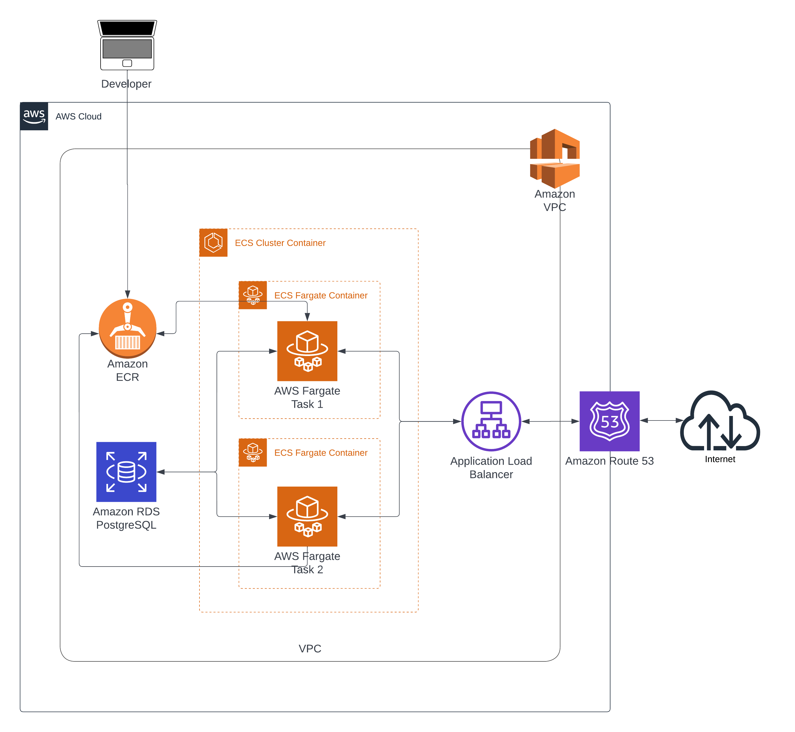

# Goodbuy in the Cloud - Capstone Project

Goodbuy is about building a tool to raise awareness what impact your consumptions
have on the plane, the society and nature and also empowers people to consume
based on their own ethical and moral consumer profile. This project is a capstone
project for the Master of Science in Software Engineering at the CODE University
of Applied Sciences in Berlin.

## Authors: Anthony Sherrill

## 15.12.2022

## Technical Paper - Goodbuy

## AWS Architecture



## Techstack

### Backend

- Python3 - version 3.10.8 - Programming language
- Django - version 4.1.4 - Web framework
- PostgreSQL - version 14.5 - Database
- AWS - Cloud provider
- AWS Application Load Balancer - Load balancer
- AWS ECR - Container registry
- AWS ECS - Container service
- AWS ECS Cluster - Container cluster
- AWS ECS Service - Container service
- AWS ECS Task Definition - Task definition
- AWS EC2 Target Group - Target group
- AWS IAM - Identity and access management
- AWS RDS - Database as a service
- AWS Route 53 - DNS
- AWS VPC - Virtual private cloud

### Frontend

- Django - Serverside Frontend rendering
- Jinja2 - Template engine

## Get the project at Github

<https://github.com/5h3rr1ll/Goodbuy/tree/cp_goodbuy>

## Required for local devolopment

- see requirements.txt and brew.txt in the project root folder and install brew
packages before pip packages.

## Environment Variables

- AWS_DEFAULT_PROFILE
- AWS_REGION
- AWS_ACCOUNT_ID
- AWS_DB_HOST
- AWS_DB_NAME
- AWS_DB_PORT
- AWS_DB_PW
- AWS_DB_USER
- DATABASEHOST
- DATABASENAME
- DATABASEUSER
- DATABASEPW
- DATABASEPORT
- DEBUG_VALUE
- DJANGO_SETTINGS_MODULE
- PGDATA
- SECRET_KEY

## AWS Access to the projects

AWS console access is required to deploy the project.
The AWS account is `a@goodbuy.sherrill.de` abd the password is `#Nix123456`

You can find a live version of the Capstone Prject at <http://www.goodbuy-cp.de>

AWS console access for the old project is `anthony.sherrill@code.berlin`, password
is `Nix123456`

You can find a live version of the old project at <http://52.57.200.136:8000>

### Local Development

Create local postgres database, for that initiate database folder like this:

```bash
initdb -D /usr/local/var/postgres
```

And set the PGDATA env var corresponding, what would be in this exampel:

```bash
export PGDATA=/usr/local/var/postgres
```

In order to use settings for local develeompent set

```bash
export DJANGO_SETTINGS_MODULE="goodbuy.settings.aws-db"
```

## Packages

See requirements.txt and brew.txt in the project root folder and install brew
packages before pip packages.

## Run the server

Go via terminal into the folder Goodbuy.

## Run the server with the command

```bash
python3 manage.py runserver 0.0.0.0:80
````

Go in your web browser to address <http://localhost> and you will
username "aws_admin" and password "#Nix123456". To you access the admin panel visit
automatically become redirected to the login site, where you can log in with
<http://127.0.0.1:8000/admin> or click the "admin" link in the "All Views" menu.

## Run Project with Docker

### Build the image

```bash
docker build --progress=plain -t goodbuy .
```

### Run the container

```bash
docker run -p 80:8000 --env-file ./.env goodbuy
```

## Run Project with Docker Compose

```bash
docker compose up
```

## Troubleshooting

If you encounter problems with installing mysqlclient this resource might help:
<https://stackoverflow.com/questions/43740481/python-setup-py-egg-info-mysqlclient>
Also, make sure you always use the correct python version while executing the
terminal commands.

### psycopg2

That library is kinda needed for the database. If you encounter problems with
installing it, try this:

```bash
pip3 install psycopg2-binary==2.8.6
```

<https://stackoverflow.com/questions/68024060/assertionerror-database-connection-isnt-set-to-utc>

## Project Files

Inside goodbuyDatabase you will find the admin.py in which you can configure what is displayed on the Admin page.

## Modules / Django Apps

### goodbuyDatabase

Inside the goodbuyDatabase directory, you will find the models.py file is for the database here you can configure your tables, define the input type and the relations between the tables. If you have done the changes, you have to migrate it to also make the changes in the database.

<!-- // TODO: Update README.md -->